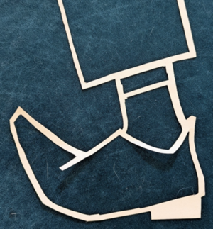
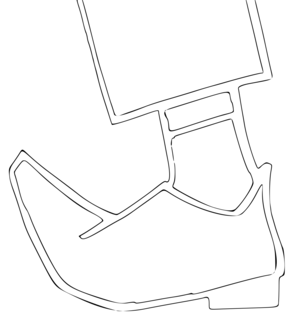
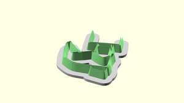

# Overview

OpenSCAD scripts to create cookie cutter style stamps from an image.

Take one image that is vaguely black and white for the pattern you want to make a stamp out of:



The `invoke svg` command turns this into a line drawing:



The `invoke stl` command turns the SVG into an STL for 3d printing:



# Install

Dependencies:
- imagemagick
- openscad
- potrace
- python3
- poetry

# Usage

1. Convert an existing black/white-ish image to an SVG pattern.
2. Run openscad to generate the pattern.
3. Make a 3d print.

```sh
poetry install
invoke svg -i zinnia.png
invoke stl -i zinnia.svg

# or both together:
invoke svg-stl -i zinnia.png
```


# Docker

The docker image can also be used to execute with the latest openscad nightly builds:

```sh

# The docker image allows for mounting any data in/out to the /data directory. Be sure to output the results back to this directory:
docker build -t cutter-maker .
docker run -it -v $PWD:/data --rm cutter-maker svg-stl -i /data/source_images/sheep.png -o /data/sheep
```
